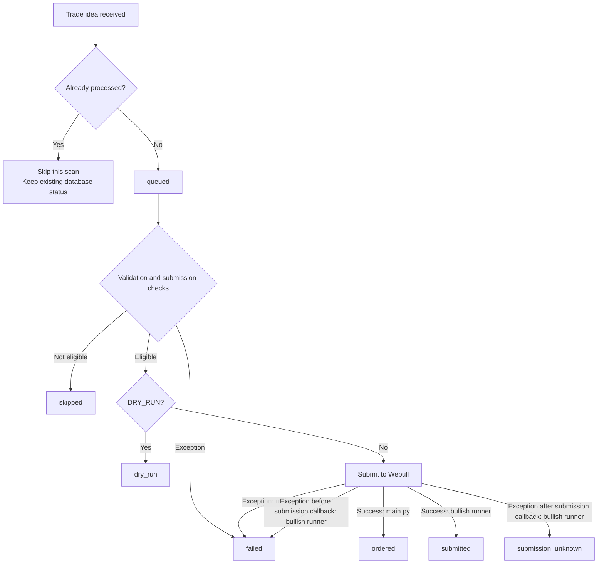
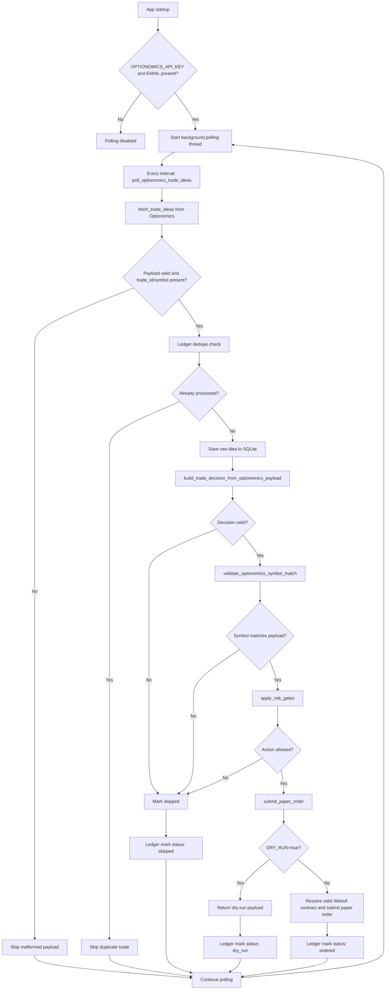

# Ops Trade Idea

This project is a paper-trading automation loop that consumes Optionomics trade ideas, validates them against a deterministic risk model, and then prepares or submits a paper order through Webull. It is designed to run as a polling service rather than an external listener.

The core entry point is [app/main.py](app/main.py). It manages configuration, fetches trade ideas, performs decision logic, stores state in SQLite, and starts the polling background worker.

## What this project does

- polls the Optionomics trade-idea API on a timer
- validates and normalizes incoming trade-idea payloads
- chooses a trading action such as buy, sell short, or skip
- enforces risk gates like symbol consistency, price-level sanity, and max notional caps
- deduplicates by trade ID to avoid repeat submissions
- resolves a valid Webull option contract from the option chain
- submits either a dry-run result or a paper order through Webull
- writes execution and decision state into SQLite for later inspection

## Architecture

The app is intentionally simple and layered around a few core pieces:

- [app/feeds/optionomics_client.py](app/feeds/optionomics_client.py): fetches trade ideas from the Optionomics API
- [app/main.py](app/main.py): orchestrates validation, risk gates, execution, and startup logic
- [app/webull-buy-combo-stock.py](app/webull-buy-combo-stock.py): stock bracket order submission used by the polling service
- [app/webull-buy-combo-option.py](app/webull-buy-combo-option.py): option bracket order submission used by `app/main-option.py`
- [app/broker/client.py](app/broker/client.py): shared sandbox client, account lookup, and order IDs
- [app/webull-option-chain.py](app/webull-option-chain.py): option-chain lookup utilities
- [bot.sqlite3](bot.sqlite3): local SQLite ledger used for dedupe and auditing
- [tests/test_apply_risk_gates.py](tests/test_apply_risk_gates.py): regression tests for the decision/risk logic

## Prerequisites

- Python 3.12+
- [uv](https://docs.astral.sh/uv/) for dependency management
- an Optionomics account with API access and a valid email + API token
- a Webull paper/sandbox account with API credentials
- optionally, a local `.env` file for runtime values

## Environment setup

Create a `.env` file in the project root:

```env
DRY_RUN=true
MAX_NOTIONAL_USD=250
ALLOW_SHORT_SELLING=false
FORCE_REPROCESS=false

OPTIONOMICS_API_KEY=your-optionomics-api-key
OPTIONOMICS_EMAIL=you@example.com
OPTIONOMICS_API_URL=https://optionomics.ai/api/v1/trade_ideas
OPTIONOMICS_POLL_ENABLED=true
OPTIONOMICS_POLL_INTERVAL_SECONDS=600

WEBULL_APP_KEY=your-webull-app-key
WEBULL_APP_SECRET=your-webull-app-secret
WEBULL_ENDPOINT=api.sandbox.webull.com

DATABASE_PATH=bot.sqlite3
```

## Run locally

For Oracle VM setup, networking, SSH, service configuration and backups, see
[deployment.md](deployment.md).

```bash
uv sync
PYTHONPATH=. uv run fastapi dev app/main.py

 DRY_RUN=true DATABASE_PATH=/tmp/bullish-preview.sqlite3 uv run python app/main-top-bullish.py

```

Or run the application directly with the repo on the Python path:

```bash
PYTHONPATH=. python app/main.py
```

Health check:

```bash
curl http://127.0.0.1:8000/health
```

### Run test

```
PYTHONPATH=. .venv/bin/python -m pytest tests/test_exit_scheduler.py -q
```

## Trade status dashboard

Open **http://127.0.0.1:8000/** while the FastAPI service is running. The page
shows trade-idea status and scheduled exit status side by side, with symbol/ID
search, status filters, an attention filter, pagination, and optional refresh
every 15 seconds. Select **View** for recorded fills, broker order references,
next-day deadline, decision rationale, and the latest reconciliation error.
All displayed timestamps use New York time.

The dashboard reads the existing SQLite ledger through `GET /api/trades` and
never places orders or queries the broker. It does not create a database when
none exists. An `ordered` idea is not proof of an open position; `complete`
means the tracked exit workflow finished, including cancelled unfilled entries.
Untracked trades show no inferred broker fill status. Standalone exit jobs
remain visible even without a corresponding trade-idea row.

The page is served by the same local FastAPI app; it has no separate frontend
build or hosted copy of your ledger. Treat the app as a local tool: these routes
do not add authentication. To preview the dashboard without starting either
trading worker, run:

```bash
PYTHONPATH=. uv run uvicorn app.main:app --host 127.0.0.1 --port 8001 --lifespan off
```

Then open http://127.0.0.1:8001/. The scheduler badge represents configuration,
not proof that a worker is running; this preview command disables startup hooks.

## iOS trading API

`app/api/trading.py` exposes a bearer-authenticated trading surface for the
iOS companion client, mounted at `/api/trading`. Set `IOS_API_KEY` in `.env`
(added to `.env.example`, empty by default). Every request needs
`Authorization: Bearer <IOS_API_KEY>`; a missing or wrong token returns 401,
and an empty key disables all four routes with 503.

- `GET /api/trading/account` — balances (`total_value`, `cash`,
  `buying_power`) and equity positions from Webull `account_v2`, mapped
  defensively from the SDK response.
- `GET /api/trading/orders?limit=50` — recent broker orders from
  `order_v3.get_order_history`, falling back to local manual-order ledger
  events when the broker is unreachable.
- `POST /api/trading/orders/preview` — validates a stock order ticket and
  returns checks (`symbol_valid`, `quantity_valid`, `price_valid`,
  `notional_cap` against `MAX_NOTIONAL_USD`), a Webull reference quote,
  estimated notional, and warnings (market closed, position shortfall).
  Never submits.
- `POST /api/trading/orders` — same ticket plus `"confirm": true`;
  re-runs the checks, then submits. With `DRY_RUN=true` nothing is sent to
  the broker and a `dry_run` event is recorded. Manual orders are recorded
  in the ledger `events` table with source `manual` under fingerprint
  `manual:<client_order_id>`.

Manual **buy** orders reuse the bot's existing stock bracket submitter
(`webull-buy-combo-stock.py`): entry at market or limit plus the configured
bullish stop/target exits. Manual **sell** orders are single-leg NORMAL
orders placed through `order_v3.place_order`, the same leg shape the
scheduled-exit market sells use. Stocks only; no option orders.

The iPhone cannot reach `127.0.0.1`; bind the server to the Mac's LAN
address so the app can connect:

```bash
PYTHONPATH=. uv run uvicorn app.main:app --host 0.0.0.0 --port 8000
```

## Scheduled next-trading-day stock exits

The optional scheduler exits tracked long stock trades at market on the next
NYSE trading session after an entry fill, defaulting to **9:35 AM New York time**.
It sells regardless of profit or loss. It handles weekends, exchange holidays,
DST, and early closes through `exchange-calendars` (`XNYS`). A missed exit is
processed during the next available regular session while the app is running.
The poll interval means execution is not guaranteed at the exact scheduled second.

```env
NEXT_DAY_EXIT_ENABLED=false
NEXT_DAY_EXIT_TIME=09:35
NEXT_DAY_EXIT_TIMEZONE=America/New_York
NEXT_DAY_EXIT_POLL_SECONDS=30
```

The feature is disabled by default. `DRY_RUN=true` prevents both scheduler
startup and broker submissions. After sandbox validation, set
`NEXT_DAY_EXIT_ENABLED=true` and `DRY_RUN=false` and restart the service to use it.
The worker runs independently of Optionomics feed polling. No `.env` values
were changed when this feature was added.

When enabled, new stock brackets retain `DAY` for the entry and use `GTC` for
both exit legs. The stop remains 5% below entry and the target 10% above entry.
Bracket IDs are stored **before** submission in `scheduled_stock_exits`; the
actual broker fill timestamp determines the scheduled date. Unfilled entries
have no exit deadline. Only newly tracked orders are managed; existing ledger
rows and positions are not automatically adopted.

Before the scheduled market sale, the worker cancels any entry remainder and
outstanding bracket exits, queries their final statuses, and subtracts all
confirmed bracket and earlier market-exit fills from the entry quantity. It
checks the current stock position and submits only the tracked remainder as a
normal `SELL / MARKET / DAY / CORE` order. A bracket that already closed the
trade completes the job without another sale. Partial market fills remain under
observation; a replacement for the remainder is possible only after the prior
order is confirmed terminal.

A persistent market-order ID is committed before each submission. If a request
times out, the worker looks up that ID on restart instead of blindly resubmitting.
The specific Webull “Order not present” error backs off lookups from 60 seconds
to 15 minutes; the dashboard shows the next lookup time and, for new submission
failures, the original submission error. Missing orders are not assumed cancelled.
Unknown or malformed responses, decreasing fill counts, unconfirmed cancellations,
and position mismatches defer the exit and record `last_error`. An ambiguous
submission that never becomes queryable requires manual broker reconciliation;
it is not automatically assumed absent. Cancellation may already have removed
protection while such an error is unresolved.

There is one active scheduled trade per account/symbol. New scheduled entries
require no existing stock position for that symbol. The bot caps exits at its
tracked fills, but manual trading or corporate actions can invalidate ownership
accounting; use a dedicated paper account for this workflow. Worker and entry
submission exclusion uses a POSIX file lock beside SQLite, supporting processes
on a single host with the same local database, not distributed deployments.

## Morning sell (10 AM ET)

An optional worker submits market sells for **all positive stock positions in
`BULLISH_STOCK_ACCOUNT_NUMBER`**, including manual/untracked holdings, once per
trading day at **10:00 AM New York time**, regardless of profit or purchase date.
It reads broker positions and rechecks each symbol before submitting its full
current quantity (`SELL / MARKET / DAY / CORE`). Options, short positions and
other accounts are excluded.

```env
MORNING_SELL_ENABLED=false
MORNING_SELL_TIME=10:00
MORNING_SELL_TIMEZONE=America/New_York
MORNING_SELL_POLL_SECONDS=60
```

The feature is disabled by default. `DRY_RUN=true` prevents worker startup and
all broker submissions. After sandbox validation, set `MORNING_SELL_ENABLED=true`
and `DRY_RUN=false` and restart the main service. Set
`BULLISH_STOCK_ACCOUNT_NUMBER` before enabling. A late start runs the pass while
that day's session is open; after close it waits until the next trading day.
Weekends and exchange holidays are skipped using the XNYS calendar.

Submission intents (`morning-sell:<date>:<account>:<symbol>`) are stored in
`events` before sending orders and block same-day retries, including failures.
Matching scheduled-exit rows are marked complete after submission; bullish rows
are marked sold only when TOP_BULLISH_ACCOUNT_NUMBER matches the selected
account. These statuses do not establish fills. Existing bracket orders are
not cancelled and sell fills are not reconciled by this worker.

Inspect state without modifying it:

```sql
SELECT id, symbol, status,
       json_extract(state_json, '$.due_at') AS due_at,
       json_extract(state_json, '$.remaining_quantity') AS remaining_quantity,
       json_extract(state_json, '$.last_error') AS last_error
FROM scheduled_stock_exits
ORDER BY updated_at DESC;
```

For unresolved submissions, inspect the saved entry/exit client IDs and broker
order history before making any manual correction. Do not delete a job or clear
its market-order attempts to force a retry: that removes duplicate-sale protection.

Implementation: `app/exits/next_day.py` (calendar and reconciliation),
`app/broker/stocks.py` (strict Webull adapter), and `app/persistence/ledger.py` (persistent
jobs). Fake-broker tests cover recovery and cancellation races; actual sandbox
acceptance of GTC bracket exits and account-specific response shapes still needs
verification before enabling the worker.

API references: [stock orders](https://developer.webull.com/apis/docs/trade-api/stock/),
[order detail](https://developer.webull.com/apis/docs/reference/order-detail/),
[cancellation](https://developer.webull.com/apis/docs/reference/common-order-cancel/),
and [positions](https://developer.webull.com/apis/docs/reference/account-position/).

## How main.py works

The runtime flow in [app/main.py](app/main.py) is split into a few clear stages.

### 1. Configuration and environment loading

`Settings` is a `BaseSettings` model that reads environment variables from `.env` and from the process environment. It includes:

- broker and polling settings
- Optionomics credentials and polling controls
- Webull credentials and endpoint
- database path
- risk controls such as `MAX_NOTIONAL_USD`, `ALLOW_SHORT_SELLING`, and `FORCE_REPROCESS`

This lets the app keep runtime settings centralized instead of hardcoding values in the code.

### 2. Data models for valid payloads and trading decisions

The file defines strict models:

- `TradeIdea`: a normalized incoming trade idea from the external feed
- `TradingDecision`: the internal action the bot decides to take
- `OptionomicsTradeIdea`: normalized Optionomics payload used for signal processing

These models enforce common rules such as:

- symbol normalization to uppercase
- direction restrictions like bullish, bearish, or neutral
- level validation for price inputs
- a consistent structure for downstream processing

### 3. Option chain helpers

The app contains helper functions that flatten raw option-chain responses and pick the nearest valid contract:

- `_flatten_option_chain()`
- `select_valid_webull_option_contract()`
- `fetch_webull_option_chain()`

This is important because Webull option contracts are not always returned in a perfectly clean shape. The selector prefers exact matches by expiration and strike, and then falls back to the nearest valid expiration and strike when necessary.

### 4. Polling loop

At app startup, `@app.on_event("startup")` checks whether polling should run:

- `OPTIONOMICS_API_KEY` and `OPTIONOMICS_EMAIL` are present
- `OPTIONOMICS_POLL_ENABLED` is true

If enabled, it launches a daemon thread that loops forever:

```python
while True:
    poll_optionomics_trade_ideas()
    time.sleep(interval_seconds)
```

This means the app does not wait for an external listener; it actively pulls trade ideas on a timer.

### 5. Polling process: from API to decision

`poll_optionomics_trade_ideas()` pulls trade ideas from the Optionomics client and processes each returned item.

For each idea, it does the following:

1. reads `trade_id` and `symbol`
2. checks deduplication in SQLite
3. saves the raw idea to the ledger as queued
4. builds a `TradingDecision` with `build_trade_decision_from_optionomics_payload()`
5. skips invalid or disallowed signals
6. validates symbol matching between payload and decision
7. submits a paper order if the decision passes all gates
8. writes the final status back to SQLite

If the app is in `DRY_RUN=true`, the actual broker call is replaced by a dry-run result object, but the logic still runs end to end.

### 6. Risk gates and decision logic

`build_trade_decision_from_optionomics_payload()` decides whether a trade idea should be:

- `buy`
- `sell_short`
- `skip`

It validates directional logic such as:

- bullish trades need `target > entry` and `stop < entry`
- bearish trades need `target < entry` and `stop > entry`
- neutral trades require positive finite levels with `target < entry < stop` and route to the iron-condor paper submitter

Neutral submission uses four listed contracts, fresh bid/ask quotes, a SELL LIMIT
credit entry, and four-leg BUY exits at 10% profit / 5% loss relative to the entry
limit credit. The selected spread's maximum loss before fees must fit
`MAX_NOTIONAL_USD`. An `events` reservation saves order IDs before sending and
blocks retries after ambiguous submissions. `DRY_RUN=true` remains broker-free.
See [the neutral iron-condor flow](netural-iron-condor.md) for the diagram,
selection rules and sandbox validation limits. `ALLOW_SHORT_SELLING` controls
bearish decisions and is not required for neutral iron condors.

`apply_risk_gates()` provides these additional deterministic guards (the current
polling path does not call it):

- symbol must match
- risk action must be consistent with signal direction
- required price levels must be present
- notional must be positive and capped by `MAX_NOTIONAL_USD`
- shorting is blocked when `ALLOW_SHORT_SELLING=false`

### 7. Order submission flow

`submit_paper_order()` is the broker-facing step.

It:

- creates a client order ID
- exits early in dry-run mode
- resolves a reference price from the payload
- selects an option expiration and strike using the Webull chain
- calls the Webull helper module to place the option order
- returns a response payload with metadata for the ledger

This is where the app turns a validated idea into a real paper-trading action.

### 8. Ledger and deduplication

The `Ledger` class manages SQLite tables:

- `events`: stores processed feed events and their decision/order state
- `optionomics_trade_ideas`: stores each Trade Idea and its final status

The ledger tracks each idea by `trade_id`. These statuses describe application
processing, not the broker's execution or fill status:

| Status | Definition |
| --- | --- |
| `queued` | The idea has been saved for processing, but no final outcome has been recorded yet. It does not mean an order is queued at Webull. A stopped process can leave this status behind. |
| `ordered` | The non-dry-run submission returned successfully and the app recorded the result. This does **not** confirm that the order filled or that the position is closed. Check Webull for execution status. |
| `failed` | An exception interrupted processing or submission. Check application logs and any stored error details. In `main.py`, this alone does **not** prove that Webull rejected or never received the order; a timeout can leave the broker outcome uncertain. |
| `skipped` | The app chose not to submit an order for this processing attempt, for example because price levels were invalid, the symbol did not match, or the market was closed. Inspect the decision rationale or stored skip reason. |
| `dry_run` | The app prepared a simulated order with `DRY_RUN=true`; it did not submit it to Webull. |

The bullish runner uses `submitted` instead of `ordered`, and uses
`submission_unknown` when an exception occurs after its submission callback.
That outcome requires broker reconciliation before retrying. Some bullish skips
(such as duplicate symbols, unavailable quotes, or exceeding the budget) appear
only in scan output and do not create or change a database row. A duplicate skip
does not change an existing `submitted` or `ordered` record to `skipped`.

#### Status transitions



`ordered` and `submitted` record successful submission, not a confirmed fill.
`submission_unknown` requires checking Webull before retrying. This diagram
summarizes processing outcomes: the bullish runner performs validation before
claiming a `queued` row, so it can skip an entry without creating a record.

### 9. Health endpoint

The FastAPI app exposes a simple readiness route:

```python
@app.get("/health")
def health() -> dict[str, Any]:
```

This returns a minimal status payload indicating the app is alive and whether dry-run mode is enabled.

## Data flow summary

The end-to-end path looks like this:



This flow mirrors the current logic in [app/main.py](app/main.py): fetch, dedupe, normalize, validate, risk-gate, and then either dry-run or submit.


## Development commands

```bash
PYTHONPATH=. uv run pytest -q
PYTHONPATH=. uv run pytest -q tests/test_apply_risk_gates.py
PYTHONPATH=. uv run python -m compileall app
```

## Notes and safety considerations

- This is a paper-trading project. It is not a full production trade system.
- `DRY_RUN=true` is the safest default for testing and validation.
- Webull option orders are not plain equity market orders; they require a valid option contract and priced entry logic.
- The app is deterministic and rule-based, which helps make behavior easy to inspect in SQLite and logs.
- This project is for educational and research use and is not financial advice.

## Useful queries

```bash
sqlite3 bot.sqlite3 "SELECT trade_id, symbol, status, decision_json FROM optionomics_trade_ideas ORDER BY created_at DESC LIMIT 20;"

sql query
SELECT trade_id, symbol, status, decision_json FROM optionomics_trade_ideas ORDER BY created_at DESC LIMIT 20;
```

```bash
sqlite3 bot.sqlite3 ".schema optionomics_trade_ideas"
```

### removed sql command

```
rm -f bot.sqlite3 bot.sqlite3.exits.lock bot.sqlite3.write.lock && ls -1 bot.sqlite3* 2>/dev/null || true
```

### Browse database records

With the FastAPI app running, open http://127.0.0.1:8000/records or select
“Browse database records” from the dashboard. Choose a ledger table, filter by
created or updated time, and use View to inspect the complete stored record.
Date inputs use your browser timezone; From is inclusive and Until is exclusive.
Today selects the current local day. Results are paginated in groups of 50.
The page is read-only and includes raw stored payloads; use it on localhost.

### Top bullish flow stock brackets

Run the standalone `MainTopBullish` runner to fetch up to 10 bullish-flow symbols,
request current Webull stock snapshots, and prepare one-share limit brackets:

```bash
DRY_RUN=true DATABASE_PATH=/tmp/bullish-preview.sqlite3 uv run python app/main-top-bullish.py --limit 10
```

Requires `OPTIONOMICS_EMAIL`, `OPTIONOMICS_API_KEY`, `WEBULL_APP_KEY`, and
`WEBULL_APP_SECRET` in the environment or `.env`, plus access to Webull snapshot
data. Quotes older than five minutes are skipped, including old quotes outside
market hours. Entry is the quoted stock price, stop is 5% below entry, and target
is 10% above entry. One share must fit `MAX_NOTIONAL_USD` (default $250).

To enable sandbox orders, use `DRY_RUN=false` with your intended `DATABASE_PATH`.
Set `TOP_BULLISH_ACCOUNT_NUMBER` to the desired sandbox account number in `.env`.
The runner requires an exact unique account match before claiming or submitting
a trade. Existing symbol deduplication still applies when changing accounts.
The runner calls `webull-buy-combo-stock.py`; exits use DAY time in force and the
runner does not start the next-day exit scheduler. It scans immediately and
then every five minutes while the process stays running. Stop with Ctrl+C;
add `--once` to run one scan and exit. Scans never overlap, missed intervals
are skipped, and a failed scan is retried at the next scheduled interval.
The feed-only `app/top-bullish.py` remains a single fetch.

Bullish scans require an open regular exchange session, including in dry-run
mode. The XNYS calendar handles weekends, holidays, early closes and DST.
Closed scans return `outside_market_hours` without fetching the feed or quotes;
the scheduler keeps checking every five minutes. Market hours are checked again
before claiming a symbol and immediately before broker submission. If the market
closes after the claim, that symbol is recorded as skipped and remains deduplicated.

The `top_bullish_trades` table is created automatically. It records the flow,
quote, order parameters, broker IDs/response, timestamps and submission status.
A trade ID or symbol already in this table is always skipped, even after a dry
run or failure. Use a separate preview database as above. Deduplication applies
to this runner's table, not other strategies or broker holdings. Ambiguous
submission failures are retained as `submission_unknown` for manual review.

## Configurable exit percentages

Set these in `.env` (values are percentages: `10` means 10%):

```dotenv
BULLISH_PROFIT_PERCENT=10
BULLISH_STOP_LOSS_PERCENT=5
BEARISH_PROFIT_PERCENT=20
BEARISH_STOP_LOSS_PERCENT=10
IRON_CONDOR_PROFIT_PERCENT=10
IRON_CONDOR_STOP_LOSS_PERCENT=5
```

These defaults preserve the existing behavior. Bullish applies to the main stock
submitter, bullish flow runner, and separate option runner's CALL brackets.
Bearish applies to PUT brackets. For long entries, target is entry ×
`(1 + profit / 100)` and stop is entry × `(1 - stop / 100)`. Iron-condor closing
debits are credit × `(1 - profit / 100)` and credit × `(1 + stop / 100)`.
Existing price rounding still applies; percentages use the entry reference/limit,
not a recalculated actual fill.

Values must be finite and positive. Bullish/bearish stop percentages and the
iron-condor profit percentage must be below 100. Invalid values prevent settings
initialization. Process environment values override `.env`. Restart the running
services after changing these values; existing broker orders are not modified.

## Strategy account selection

| Execution path | Account setting |
| --- | --- |
| `main.py` bullish stock branch | `BULLISH_STOCK_ACCOUNT_NUMBER` |
| `main-top-bullish.py` stock runner | `TOP_BULLISH_ACCOUNT_NUMBER` |
| Bearish PUT via `main.py` or `main-option.py` | `OPTIONS_MARGIN_ACCOUNT_NUMBER` |
| Neutral iron condor via either main entry point | `OPTIONS_MARGIN_ACCOUNT_NUMBER` |

These paths share `app.broker.client.get_account_id(account_number=...)`.
Each trims the configured account number, requires a nonempty value, queries the
broker account list and requires exactly one matching `account_number` with an
API `account_id`. Missing or ambiguous matches stop submission; these paths do
not fall back to the first account. The returned API ID is used in the order.
Dry runs do not perform this account lookup.

Set both variables to the same intended account number to use one account for
all three paths. They remain separate settings so they can also select different
accounts. The local configuration was compared and the two values matched on
2026-09-16; actual account identifiers remain only in local `.env`. No live
account lookup or account-type/permission verification was performed.

The main service's bullish stock branch uses its own required
`BULLISH_STOCK_ACCOUNT_NUMBER`, with the same exact-match lookup and no fallback.
The separate `main-option.py` CALL path still selects the first returned account.
See [bullish-stock.md](bullish-stock.md) for the main-service diagram.

Process environment overrides `.env`. Restart the affected services after an
account change. Existing orders and ledger reservations are not moved or reset.
The separate strategies do not share a complete position/deduplication guard.

For the dedicated bullish runner’s end-to-end diagram, account selection,
configurable exits and ledger behavior, see [bullish.md](bullish.md).

## Delayed PUT quotes for paper testing

`BEARISH_QUOTE_MAX_AGE_SECONDS` controls the bearish PUT ask timestamp age limit.
The code and `.env.example` default to 60 seconds. Local `.env` is set to 1200
seconds (20 minutes) to allow Webull's approximately 15-minute-delayed sandbox
quotes. Entry and profit/stop prices therefore use the delayed premium, not a
real-time price. Restart the service after editing the setting.

Values must be positive integer seconds. Quotes beyond the configured limit,
invalid/nonfinite prices or timestamps, and quotes more than five seconds in
the future remain rejected. This setting does not change stock or iron-condor
quote limits. Both bearish entry points use the shared submitter. No orders
were placed to enable this setting.

Neutral iron-condor submissions use the independent
`IRON_CONDOR_QUOTE_MAX_AGE_SECONDS` setting. It defaults to 60 seconds; local
`.env` sets it to 1200 seconds for delayed sandbox paper testing. All four legs
must have valid bid/ask prices and timestamps within this limit. The five-second
future tolerance remains unchanged. Credit and exit prices use those delayed
premiums. Restart the service to apply changes.


## Package layout

Application code is grouped by functionality:

```text
app/
  main.py           # FastAPI composition, polling and worker startup
  bullish/          # Bullish feed, runner, ledger and stock brackets
  bearish/          # Bearish PUT execution
  ironcondor/       # Neutral iron-condor execution
  broker/           # Webull clients, quotes, positions and errors
  feeds/            # Optionomics retrieval and decision normalization
  persistence/      # SQLite ledger and locks
  exits/            # Morning sells and next-session exit workers
  options/          # Shared option contracts, brackets and alternate runner
  execution/        # Strategy dispatch and order submission
  config/           # Runtime and strategy settings
  api/              # Authenticated trading endpoints
  ui/               # Dashboard, records and static assets
  common/           # Feature-independent paths
```

Use `uv run python -m app.bullish.runner` for bullish polling (`--once` for one
scan). The API command remains `uvicorn app.main:app`. Existing hyphenated
scripts such as `app/main-top-bullish.py` remain compatibility entry points,
so installed systemd commands continue working. Internal imports use the new
packages; shared option helpers use standard imports rather than file loaders.
The older alternate options runner lives at `app.options.runner`.
Repository `.env` discovery and dashboard asset URLs are unchanged. Database paths,
schemas and strategy behavior are unchanged by this reorganization.

## Webull paper and live environments

`WEBULL_TRADING_MODE=paper` is the default. Set `WEBULL_TRADING_MODE=live`
to select production for orders, accounts, snapshots and option-chain lookups.
`WEBULL_ENDPOINT` may be blank (automatic) or must match the mode exactly:
`api.sandbox.webull.com` for paper, `api.webull.com` for live. Conflicting hosts
or unknown modes raise an error. Hosts follow the
[Webull environment documentation](https://developer.webull.com/apis/docs/sdk/).

Example live configuration:

```dotenv
WEBULL_TRADING_MODE=live
WEBULL_ENDPOINT=api.webull.com
WEBULL_APP_KEY=your-production-app-key
WEBULL_APP_SECRET=your-production-app-secret
DRY_RUN=true
DATABASE_PATH=bot-live.sqlite3
```

Configure the production account numbers in `.env`:

```dotenv
WEBULL_LIVE_BULLISH_STOCK_ACCOUNT_NUMBER=
WEBULL_LIVE_TOP_BULLISH_ACCOUNT_NUMBER=
WEBULL_LIVE_OPTIONS_MARGIN_ACCOUNT_NUMBER=
```

The fields select the main stock/API/morning-sell account, dedicated bullish
runner account, and PUT/iron-condor (also alternate CALL runner) account,
respectively. Fill in each account used by your enabled strategies. Live mode
never falls back to legacy or paper account fields. Matching `WEBULL_PAPER_`
fields select paper accounts; the original unprefixed account settings remain
paper-only fallbacks. Account numbers must match exactly one broker account. Use separate paper/live database paths: saved reservations,
order IDs and exit jobs are not namespaced by environment. Do not reuse a paper
ledger for live workers. Restart all application and runner processes after
changing mode, credentials, accounts or database path; SDK clients and settings
are cached for the process lifetime.

`DRY_RUN=true` keeps application order submission disabled even in live mode.
Set `DRY_RUN=false` to enable real orders through the application workers/API.
Standalone low-level order examples do not implement the application's dry-run
gate and can submit when executed. Existing strategy, sizing, retry and exit
behavior is unchanged; switching environments does not resolve the budget,
ambiguous-submission retry, or morning-exit reconciliation gaps.

## Live bullish stock cash orders

`WEBULL_LIVE_BULLISH_AMOUNT_USD=100` sets the cash amount requested per automated
live bullish stock entry. The main Optionomics bullish stock flow and dedicated
bullish runner use `NORMAL / MARKET / DAY / CORE` orders with
`entrust_type=AMOUNT`. Cash amounts across the planned orders sum to $100. No
quantity is estimated or sent: Webull determines the filled fractional shares. The setting does not change
paper trading, bearish PUTs, neutral iron condors, the alternate CALL runner, or
explicit quantity tickets submitted through the manual trading API.

The requested amount must fit MAX_NOTIONAL_USD (and the main decision budget).
Webull documents each cash order for less than one share and a $5 fractional
minimum. A fresh quote is used to split the budget into cent-exact cash orders:
$200/share uses one $100 order; $100/share uses two $50 orders; $30/share uses
four $25 orders. Each individual order is at least $5 and below the quoted share
price. If no such split exists (including quotes at/below $5 for a $100 budget),
the stock is skipped. Broker eligibility/permissions and price changes still
apply. The requested total is $100, not a guarantee of full fills or an all-in
debit including fees. See [Webull stock order rules](https://developer.webull.com/apis/docs/trade-api/stock/).

Each cash leg is persisted before its own broker request. If the market closes,
a request fails or the process stops mid-plan, unsent legs are abandoned rather
than replayed. This can leave less than $100 invested; attempted legs still need
reconciliation. Newly submitted live cash buys do not create app-managed
profit, stop-loss, next-day, or morning sell triggers. Positions remain open
until you submit a separate sell order; there is no app-managed exit protection.

The cash worker runs every 10 seconds to reconcile pending buy orders and any
sell orders already submitted before this behavior change. It does not poll
quotes or submit replacement/automatic sells. Order-detail requests are paced
to respect the documented query limit; unresolved orders may still be delayed
by broker rate limits. Existing paper bracket/exit behavior remains unchanged.

Keep either the FastAPI service or continuous bullish runner running with the
same live database to reconcile uncertain or partial live cash orders. Live
non-dry-run `--once` is rejected because it would stop that reconciliation.

Entries require a flat position and no active exit job for that account/symbol.
Order intent and client IDs are persisted before submission. An ambiguous entry
or sell response is reconciled by its saved ID; it is never blindly retried.
Missing orders require reconciliation, not deletion of reservations. Previously
submitted terminal partial sells are not replaced with additional sells. Cash jobs are
stored in `scheduled_stock_exits` with `kind=live_cash`; the regular bracket
scheduler leaves them to the cash worker. All workers share the database exit
lock. `DRY_RUN=true` previews the cash request without broker calls, reservations,
or live quote/eligibility validation; the exact split is deferred until a fresh
quote is available. Tests use fake clients; live acceptance and
broker response fields have not been verified with a real order.

Daily live entry limits are configured separately for bullish stocks and options.
See [run.md](run.md#daily-live-entry-budgets) for settings and reservation behavior.
