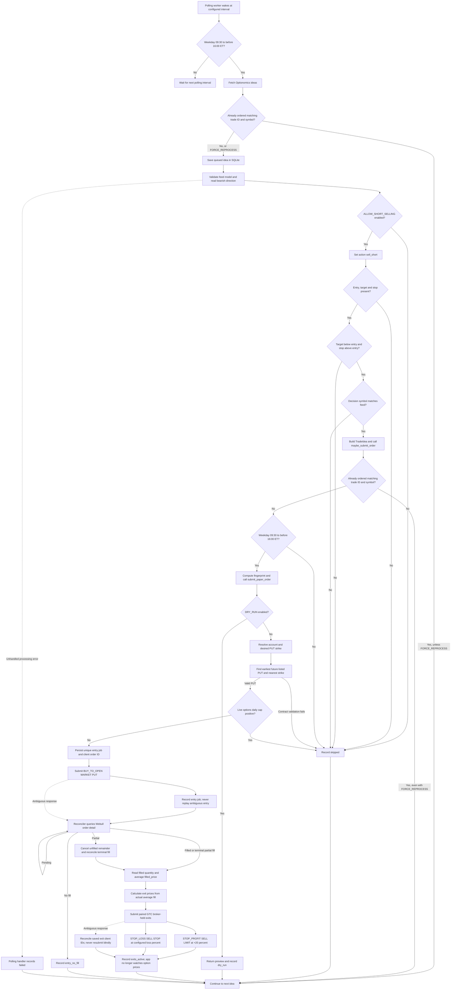

# Bearish direction and execution flow

Exit percentages are configurable with `BEARISH_PROFIT_PERCENT` and
`BEARISH_STOP_LOSS_PERCENT` in `.env`. Percentages shown below are defaults;
restart services after editing. Existing orders are unchanged.

This documents the current `app/main.py` polling path, verified from source on
2026-10-02. Direction comes from the Optionomics feed; the application does not
calculate a bearish signal from market prices.

## Decision logic

In [app/feeds/decisions.py](app/feeds/decisions.py),
`build_trade_decision_from_optionomics_payload` handles `direction == "bearish"`:

- If `ALLOW_SHORT_SELLING=false` (the default), skip the idea.
- If enabled, set the internal action to `sell_short`.
- Require all three feed levels: entry, target, and stop.
- Validate the bearish levels using `validate_optionomics_directional_levels`:

```python
if direction == "bearish":
    return target < entry and stop > entry
```

For example, entry 100, target 90, and stop 105 pass. Equal target/entry or
stop/entry values fail. Invalid or missing levels produce a skipped decision.
The decision uses `MAX_NOTIONAL_USD` and normalized confidence. The pipeline
label is `iron_condor` for Crush and `placeholder` otherwise; bearish execution
is routed by action, regardless of that label.

[app/main.py](app/main.py)'s `build_trade_decision` has a separate bearish branch
with equivalent direction and level checks. The polling path uses the Optionomics
builder through its compatibility wrapper.

## End-to-end flow



Unhandled exceptions elsewhere in per-idea processing also reach the polling
handler and mark the idea failed. Feed-fetch `RuntimeError` ends that scan.
The fill reconciler starts at application startup even when new feed polling is
disabled, so persisted entries can be completed after a restart. A database file
lock prevents the main and dedicated option runners from reconciling the same job
concurrently. When both trade ID and symbol are supplied, feed deduplication
requires both to match an `ordered` row; it is not a permanent symbol-only
exclusion.

## PUT bracket construction

[app/execution/submitter.py](app/execution/submitter.py) routes `sell_short` to
[BearishPutLifecycle](app/bearish/lifecycle.py). It persists the entry intent,
submits a single-leg market PUT, and reconciles its fill before attaching exits.

| Parameter          | Current implementation                                                                                           |
| ------------------ | ---------------------------------------------------------------------------------------------------------------- |
| Reference level    | First truthy payload entry, target, or stop; otherwise `max(notional_usd / 100, 1)`                              |
| Expiration         | Earliest listed PUT expiration after today (UTC); excludes expired and same-day contracts                        |
| Requested strike   | `round(reference_level / 5) * 5`                                                                                 |
| Entry premium      | Webull order detail `filled_price`; no snapshot request or estimated-premium fallback                            |
| Contract selection | Paginated PUT chain; earliest eligible listed expiration and closest available strike                            |
| Quantity           | One contract                                                                                                     |
| Entry              | PUT `BUY`, `BUY_TO_OPEN`, MARKET, DAY                                                                            |
| Entry              | PUT `BUY`, `BUY_TO_OPEN`, MARKET, DAY; Webull may reject market orders for limited-liquidity contracts           |
| Take profit        | Broker-held `STOP_PROFIT` PUT SELL LIMIT at actual average fill plus 20%                                         |
| Stop loss          | Broker-held `STOP_LOSS` PUT SELL stop at actual average fill minus configured percent; live toggle still applies |
| Price rounding     | Exit prices use the average fill, then round to a 0.05 tick                                                      |
| Exit duration      | GTC                                                                                                              |

The feed target and stop validate the underlying bearish setup. Exit prices are
calculated from the option fill, not those underlying levels. Current Webull
options documentation supports MARKET option orders and order detail exposes
`filled_quantity` and average `filled_price`. After a full fill, or after
canceling an unfilled remainder of a partial fill, the reconciler submits only
`STOP_PROFIT` and `STOP_LOSS` closing orders under one combo ID. Webull documents
that closing an existing option position uses these sub-orders without a MASTER
order. The profit exit is a broker-held LIMIT order, not a market sell; the app
does not need snapshots or price polling after Webull accepts the exits.

The market entry is persisted before the request. Ambiguous submission or fill
The market entry is persisted before the request. Ambiguous submission or fill
lookup is reconciled against the saved client order ID and never blindly replayed.
Webull's `OPENAPI_OPTION_NOT_ALLOW_PLACING_MARKET_ORDER` response is definitive:
the job becomes `entry_rejected`, is removed from reconciliation, and the idea is
logged/skipped. Existing stuck jobs carrying that error are repaired on the next
poll. There is no automatic limit fallback because a limit requires a valid option
premium; the old snapshot endpoint was denied for this account. Enable option
market-data access or provide an explicit, operator-approved limit price before
adding a limit-entry fallback. Malformed or unavailable fill data remains pending
for later reconciliation.

When `WEBULL_TRADING_MODE=live` and `WEBULL_LIVE_OPTIONS_DAILY_LIMIT_USD` is
positive, bearish market entries are skipped. Their premium is unknown until the
fill, so the configured cap cannot be safely reserved before entry. A value of
zero disables this cap. Market entry has no premium ceiling; one contract can
cost more than the decision's underlying notional.

## Implementation limits and naming discrepancies

- `sell_short`, the short-selling setting, and returned `side: SELL` metadata
  describe the internal routing. The actual entry order buys a PUT; it does not
  short stock. The executor's strategy label is `sell_next_way`.
- The market-hours check applies before dry-run handling too. It checks weekdays
  and clock time, without exchange holiday or early-close handling.
- `apply_risk_gates` is not called by this polling/submission path. Quantity is
  fixed at one contract rather than sized to the decision's notional budget.
- The PUT contract lookup filters for `option_type: PUT` before selecting
  expiration and strike. Missing contract type or unavailable PUTs fail validation.
- `bearish_option_jobs` tracks entry reconciliation until broker exits are
  accepted. Later position and exit-fill monitoring remain broker-side/manual.
- `ordered` means the entry job was durably accepted by the application, not that
  Webull confirmed a fill or completed an exit. Mocked broker tests cover the flow;
  no live or sandbox order has validated runtime behavior.

Related regression coverage lives in
[tests/test_apply_risk_gates.py](tests/test_apply_risk_gates.py) and
[tests/test_bearish_lifecycle.py](tests/test_bearish_lifecycle.py).

## Account selection

`OPTIONS_MARGIN_ACCOUNT_NUMBER` in `.env` selects the shared individual margin
account for bearish PUT and iron-condor submissions. The broker account list
must contain exactly one matching account number with a valid API account ID;
missing configuration or unmatched/ambiguous accounts stop submission. No
first-account fallback is used. Restart services after changing this setting.
The account type and permissions have not been verified with a live lookup.

This is the same shared `get_account_id(account_number=...)` lookup used by
`main-top-bullish.py`, which reads `TOP_BULLISH_ACCOUNT_NUMBER`. Setting both
variables to the same value routes these strategies to the same account.
The local values matched when checked on 2026-09-16; no live lookup was made.
See [the account comparison](README.md#strategy-account-selection) for the
separate main-service bullish/CALL paths and restart requirements.

Expiration selection now queries listed PUT contracts without an exact-date
filter. The hardcoded five-day offset is removed from the shared bearish path;
main-option.py bearish submission delegates to that path too. The existing
exact-or-next-listed resolver is shared through `app/options/expiration.py`.
Empty chains skip execution; no synthetic expiration is used.

## Quote setting scope

`BEARISH_QUOTE_MAX_AGE_SECONDS` is used only by the legacy direct-call
`buy_put_with_bracket` helper. The Optionomics bearish path no longer requests
option snapshots, so this setting does not affect its market entry or exits.

## Legacy snapshot helper

`buy_put_with_bracket` in `app/options/brackets.py` remains for direct callers and
still uses `current_option_ask`; the Optionomics bearish path no longer calls it.
`BEARISH_QUOTE_MAX_AGE_SECONDS` applies only to that legacy helper.
